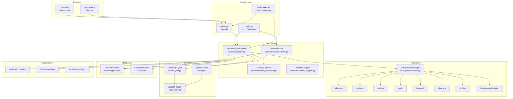
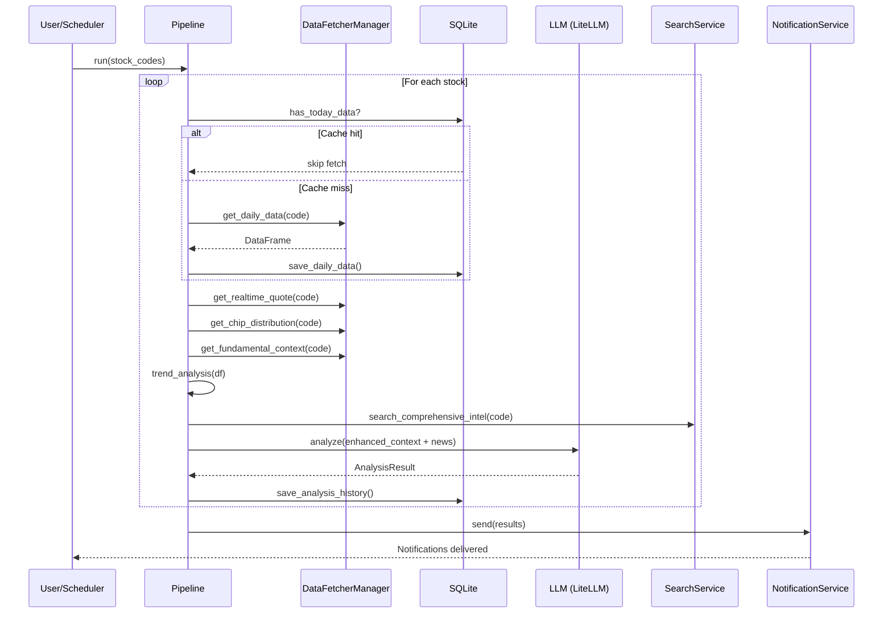

# System Architecture

> High-level architecture of the Daily Stock Analysis (DSA) system.

---

## Architecture Diagram



---

## Layer Description

### 1. Entry Layer

Three ways to enter the system:

| Entry | Mode | Description |
|-------|------|-------------|
| `main.py` | CLI | Parses args, runs one-shot or scheduled analysis |
| `server.py` | API | FastAPI ASGI server with REST endpoints |
| `bot/` | Chat | Message handler → command dispatcher → analysis |

The `main.py` supports combined modes: `--serve` starts API server in a background thread while still running analysis.

### 2. Core Pipeline (`src/core/`)

**`StockAnalysisPipeline`** is the central orchestrator (1475 lines):

```
For each stock in watchlist:
  1. fetch_and_save_stock_data() — DB cache check → DataFetcherManager
  2. analyze_stock() — 8-step analysis:
     a. Get realtime quote (with circuit breaker)
     b. Get chip distribution
     c. Get fundamental context (with timeout budget)
     d. Run trend analysis (MA alignment, buy signals)
     e. Search news intelligence (multi-dimensional)
     f. Get social sentiment (US only)
     g. Build enhanced context
     h. Call LLM analysis → AnalysisResult
  3. Notify — send results through configured channels
```

**Two analysis paths:**
- **Traditional path** — Direct LLM call with enhanced context
- **Agent path** — Multi-agent pipeline (intel → technical → risk → decision)

### 3. Data Provider Layer (`data_provider/`)

`DataFetcherManager` implements a **priority-ordered fallback chain**:

```
efinance (P0) → akshare (P1) → tushare (P2) → pytdx (P2) → baostock (P3) → yfinance (P4)
```

Each fetcher extends `BaseFetcher` with:
- `_fetch_raw_data()` — Provider-specific API call
- `_normalize_data()` — Standardize to `STANDARD_COLUMNS`

**Specialized subsystems:**
- **Realtime quotes** — Tencent → Sina → efinance → EastMoney with circuit breaker
- **Chip distribution** — Via DataFetcherManager with fuse protection
- **Fundamental pipeline** — Aggregated context with timeout/retry/cache

**Market routing:**
- US stocks (`^[A-Z]{1,5}$`) → `YfinanceFetcher` (early return, no fallback)
- HK stocks (`HK` prefix) → General chain
- A-share (6-digit) → General chain

### 4. AI Layer

**GeminiAnalyzer** (`src/analyzer.py`):
- Uses LiteLLM for unified model access
- Supports multi-channel configuration (YAML or env vars)
- Temperature, retry, and token limit controls
- Report integrity validation with placeholder fill

**Agent System** (`src/agent/`):
- **Architecture:** `single` (legacy) or `multi` (orchestrator)
- **Orchestrator modes:** quick / standard / full / specialist
- **Specialized agents:** intel, technical, risk, decision, portfolio
- **Skill system:** 11 YAML strategies (shrink_pullback, bull_trend, chan_theory, etc.)
- **Tool registry:** analysis, data, market, search, backtest tools

### 5. Intelligence Layer

**SearchService** — Multi-engine news search:
- Engines: Tavily, Bocha, Brave, SerpAPI, SearXNG (self-hosted + public)
- Multi-key load balancing per engine
- Multi-dimensional search: latest news + risk scan + earnings
- Configurable news window (ultra_short/short/medium/long)

**SocialSentimentService** — US stocks only:
- Reddit, X (Twitter), Polymarket data
- External API at api.adanos.org

### 6. Output Layer

**NotificationService** — 12 channels:
| Channel | Type |
|---------|------|
| WeChat Enterprise | Webhook |
| Feishu | Webhook |
| Telegram | Bot API |
| Email | SMTP |
| Discord | Bot / Webhook |
| Slack | Webhook / Bot |
| PushPlus | Token |
| Pushover | API |
| Server酱3 | SendKey |
| Custom Webhook | POST JSON |
| AstrBot | Token |
| Feishu Cloud Docs | API |

Features: batch splitting for length limits, markdown-to-image for non-MD channels, merged notification mode, stock-group email routing.

**Database** — SQLite via SQLAlchemy:
- Analysis history with context snapshots
- News intelligence cache
- Fundamental snapshots
- Backtest results
- Portfolio data

### 7. Frontend Layer

**dsa-web** (React 19 + Vite 7):
- Pages: Home (analysis), Chat (AI chat), Portfolio, Backtest, Settings
- Zustand state management
- Axios API client with auth context
- TailwindCSS 4 styling
- Motion animations
- Recharts for data visualization

**dsa-desktop** (Electron):
- Wraps dsa-web build output
- Platform-specific build scripts
- GitHub Actions release workflow

---

## Data Flow



---

## Configuration Architecture

All configuration flows through `src/config.py` → `Config` dataclass:

```
.env file → python-dotenv → os.getenv() → Config._load_from_env() → Config (singleton)
```

Config groups (~2150 lines):
- Stock list, Feishu docs, data source tokens
- AI/LLM: multi-channel, multi-key, temperature, retry
- Agent: mode, architecture, skills, orchestrator settings
- Search: 6 engine configs with multi-key support
- Notification: 12 channel configurations
- Backtest, portfolio, trading calendar
- WebUI, bot, flow control, logging
